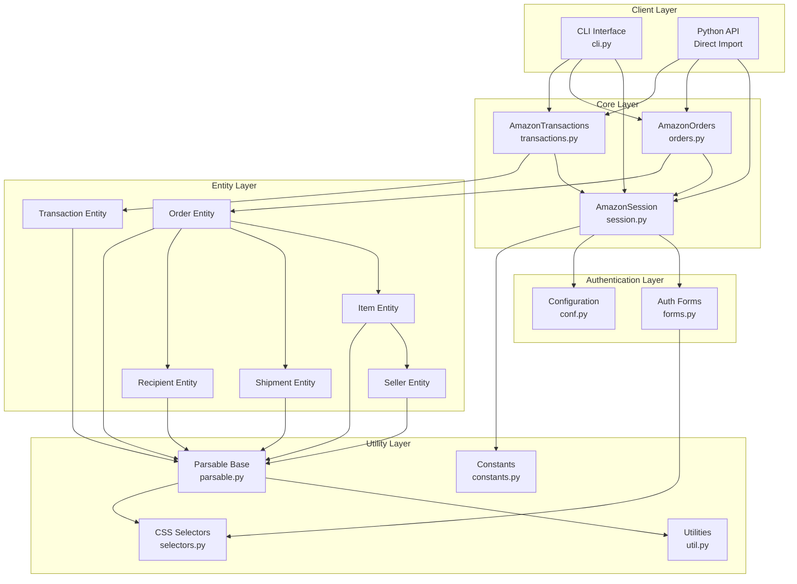
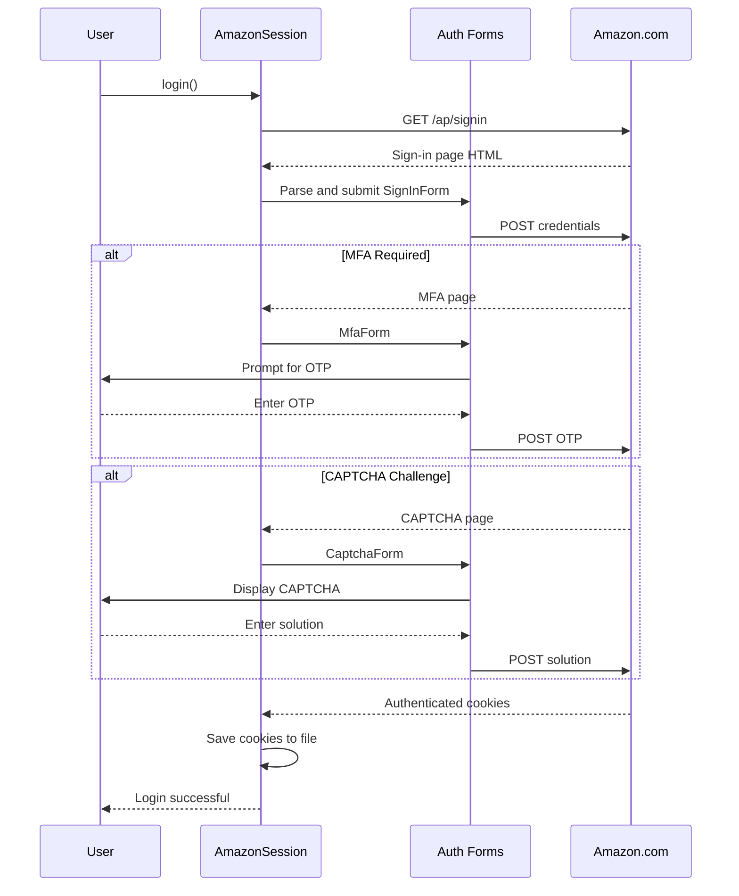
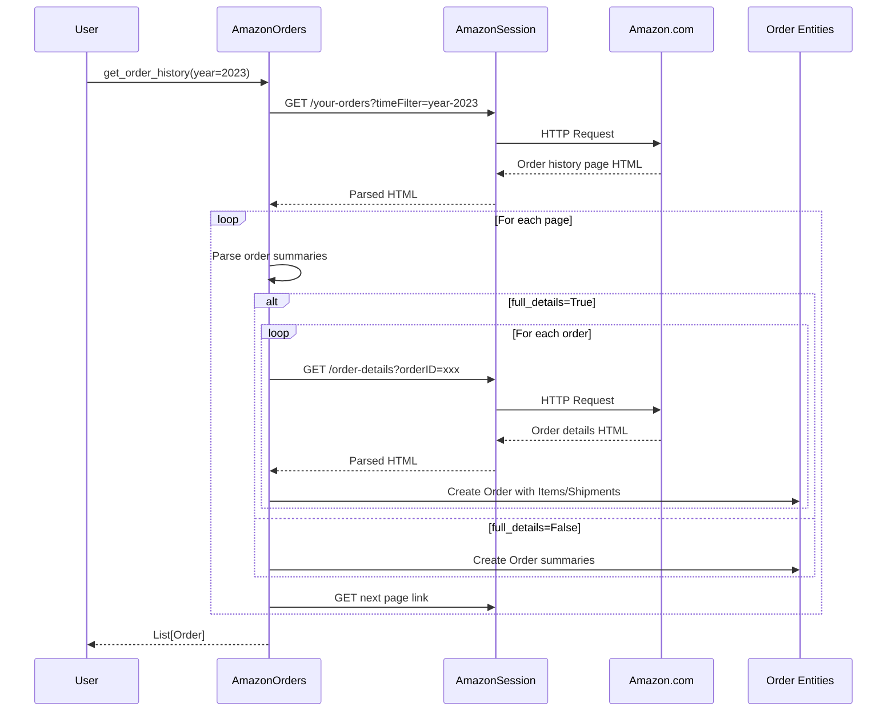
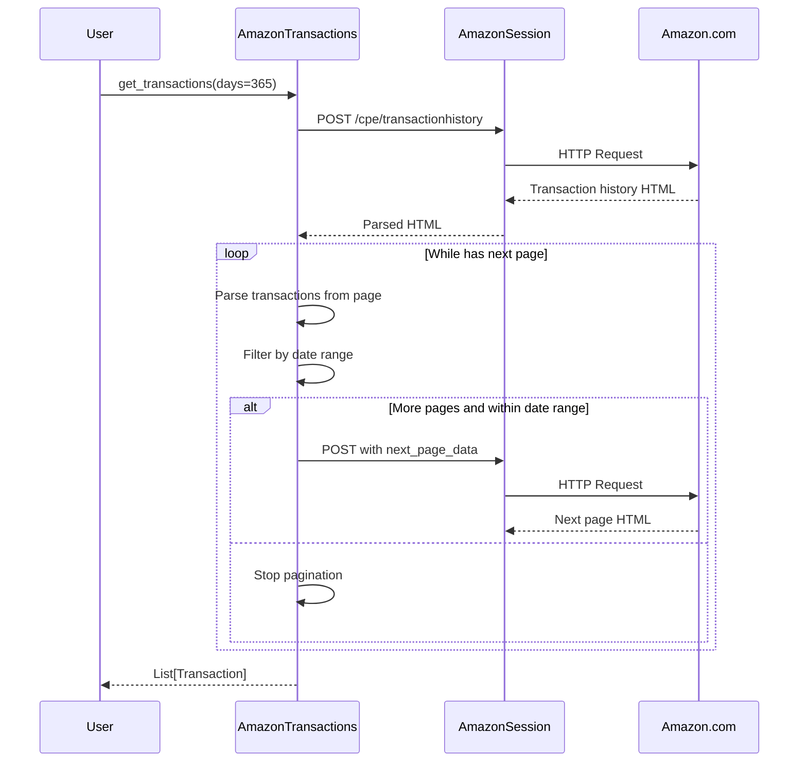
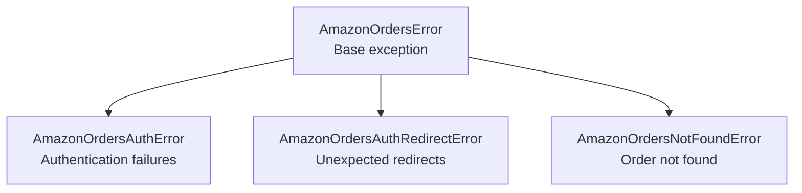
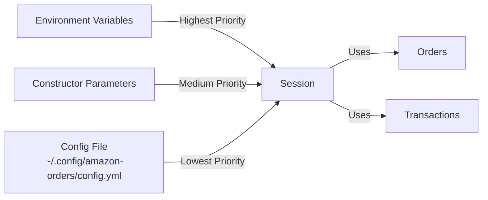
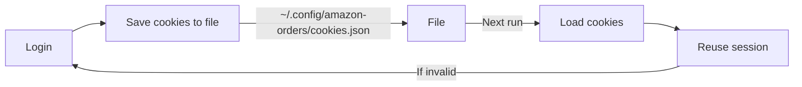

# Architecture Documentation

## Overview

`amazon-orders` is a Python library that provides programmatic access to Amazon order history by parsing Amazon's consumer-facing website. The library follows a layered architecture pattern with clear separation of concerns.

## System Architecture



## Component Descriptions

### Client Layer

**CLI Interface (`cli.py`)**
- Provides command-line interface using Click framework
- Handles user input/output via `IOClick` class
- Supports commands: login, history, order, transactions
- Manages command-line arguments and options

**Python API**
- Direct import and usage of library classes
- Provides programmatic access to all functionality
- Suitable for integration into other Python applications

### Core Layer

**AmazonSession (`session.py`)**
- Manages HTTP session with Amazon
- Handles authentication flow
- Supports multiple authentication forms (MFA, CAPTCHA, sign-in)
- Persists session cookies for reuse
- Environment variables: `AMAZON_USERNAME`, `AMAZON_PASSWORD`, `AMAZON_OTP_SECRET_KEY`

**AmazonOrders (`orders.py`)**
- Retrieves order history and details
- Supports pagination through order history
- Async processing for parallel order detail fetching
- Key methods:
  - `get_order(order_id)` - Get full order details
  - `get_order_history(year, full_details)` - Get order history

**AmazonTransactions (`transactions.py`)**
- Retrieves transaction history
- Supports date-based filtering
- Handles pagination through transaction pages
- Key method: `get_transactions(days)` - Get transaction history

### Authentication Layer

**Auth Forms (`forms.py`)**
- Handles various authentication challenges:
  - `SignInForm` - Username/password login
  - `MfaForm` - Multi-factor authentication
  - `CaptchaForm` - CAPTCHA solving (static images)
  - `MfaDeviceSelectForm` - Device selection for MFA
  - `ClaimForm` - Account claim verification
  - `JSAuthBlocker` - JavaScript-based auth blockers
- Each form implements parsing and submission logic

**Configuration (`conf.py`)**
- Manages library configuration
- Loads/saves settings from YAML config file
- Default location: `~/.config/amazon-orders/config.yml`
- Configurable: credentials, output directory, thread pool size

### Entity Layer

**Order Entity (`entity/order.py`)**
- Represents an Amazon order
- Properties: order_number, grand_total, order_placed_date, payment_method
- Contains collections of Items, Shipments, Recipient
- Supports full_details mode for complete information
- Tracks index in order history

**Transaction Entity (`entity/transaction.py`)**
- Represents a financial transaction
- Properties: completed_date, grand_total, payment_method, seller
- Links to associated order via order_number
- Identifies refunds vs charges

**Item Entity (`entity/item.py`)**
- Represents a product in an order
- Properties: title, link, price, quantity, condition
- Contains Seller information
- Includes return eligibility date

**Shipment Entity (`entity/shipment.py`)**
- Represents order shipment details
- Properties: delivery_status, shipped_date, delivered_date

**Recipient Entity (`entity/recipient.py`)**
- Represents delivery recipient
- Properties: name, address

**Seller Entity (`entity/seller.py`)**
- Represents product seller
- Properties: name, link

### Utility Layer

**Parsable Base (`entity/parsable.py`)**
- Base class for all entities
- Provides parsing utilities for HTML
- Methods for safe parsing, currency conversion, date parsing
- Uses BeautifulSoup for HTML parsing

**Utilities (`util.py`)**
- Helper functions for HTML selection and parsing
- Response wrapper classes
- Common utility methods

**Selectors (`selectors.py`)**
- CSS selectors for Amazon HTML elements
- Centralized selector management
- Allows easy updates when Amazon changes HTML

**Constants (`constants.py`)**
- Amazon URLs and endpoints
- Regex patterns
- Configuration defaults

## Data Flow

### Authentication Flow



### Order History Retrieval Flow



### Transaction Retrieval Flow



## Error Handling

The library uses a hierarchical exception structure:



All exceptions include optional `meta` dict for debugging context (e.g., current index in pagination).

## Configuration Management



**Priority Order:**
1. Environment variables (`AMAZON_USERNAME`, `AMAZON_PASSWORD`, `AMAZON_OTP_SECRET_KEY`)
2. Constructor parameters to `AmazonSession`
3. Configuration file values

## Async Processing

The library uses Python's `asyncio` for parallel order detail fetching:

```python
# In AmazonOrders._build_orders_async()
order_tasks = []
for order_tag in order_tags:
    order_tasks.append(self._async_wrapper(self._build_order, order_tag, full_details, current_index))

return await asyncio.gather(*order_tasks)
```

This allows multiple order detail requests to run concurrently using a thread pool, significantly improving performance when `full_details=True`.

## Session Persistence

Sessions are persisted to avoid repeated authentication:



The session automatically:
- Saves cookies after successful authentication
- Loads cookies on initialization
- Validates session before requests
- Re-authenticates if session expired

## HTML Parsing Strategy

The library uses BeautifulSoup with a selector-based approach:

1. **Selectors** (`selectors.py`) - CSS selectors for all HTML elements
2. **Parsable** (`parsable.py`) - Base class with parsing methods
3. **Safe Parsing** - Methods handle missing elements gracefully
4. **Required Fields** - Specified fields throw errors if missing

This design allows quick updates when Amazon changes their HTML by updating only the selectors.

## Extension Points

To extend the library:

1. **Custom Auth Forms** - Add new form handlers to `auth_forms` parameter
2. **Custom Entities** - Subclass `Parsable` and override in config
3. **Custom I/O** - Implement `IODefault` interface for custom input/output
4. **Custom Config** - Create `AmazonOrdersConfig` subclass with custom selectors

Example custom entity:

```python
class CustomOrder(Order):
    def __init__(self, parsed, config, **kwargs):
        super().__init__(parsed, config, **kwargs)
        # Add custom parsing logic
        self.custom_field = self.safe_simple_parse(selector=".custom-selector")

# Use in AmazonOrders
config = AmazonOrdersConfig()
config.order_cls = CustomOrder
orders = AmazonOrders(session, config=config)
```

## Performance Considerations

1. **Pagination** - Use `keep_paging=False` to limit to one page
2. **Full Details** - Only enable when needed (adds 1 request per order)
3. **Thread Pool** - Configure `thread_pool_size` in config for async processing
4. **Session Reuse** - Persist sessions to avoid re-authentication
5. **Start Index** - Resume from specific index if process interrupted

## Security Considerations

1. **Credentials** - Store in environment variables or secure config file (chmod 600)
2. **Session Cookies** - Stored in `~/.config/amazon-orders/cookies.json`
3. **OTP Secret** - Allows automated MFA but must be securely stored
4. **Debug Mode** - May log sensitive data; use only during development
5. **CAPTCHA Solving** - Some interactive CAPTCHAs cannot be automatically solved

## Known Limitations

1. **Non-.com Sites** - Only amazon.com officially supported
2. **Non-English** - Only English language supported
3. **Interactive CAPTCHAs** - JavaScript-based puzzles cannot be solved
4. **Device Memory** - Amazon may re-prompt for OTP even when device remembered
5. **HTML Changes** - Amazon updates may break parsing until selectors updated
